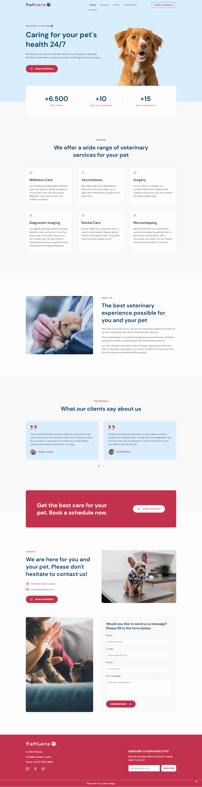
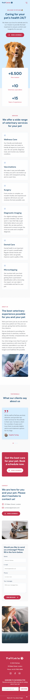

## Project PetCare 🐶🐱

Project developed during the Next Level Week (NLW Return), created by Rocketseat, a Brazilian learning platform. We were challenged to develop our own landing page and make modifications to the original project to put into practice the knowledge acquired during the classes. I developed a landing page for a fictional veterinary clinic, called PetCare. 

The page contains a header, five main sections: hero, services, about, testimonials and contact, a banner ad, and a footer.
- Header: logo and navigation, the mobile and tablet versions contain a collapsible menu;
- Hero: headline, sub-headline, call-to-action (Whatsapp link), hero image, and stats about the company;
- Services: services offered by the clinic;
- About: image and information about the clinic;
- Testimonials: a slider with client testimonials; 
- Banner: advertisement with call-to-action message;
- Contact: images, address, email, call-to-action, and a contact form;
- Footer: logo, address, phone, social media links, and a newsletter subscription form. 

## Technologies

- HTML
- CSS
- JavaScript

## JavaScript Libraries

- <a href="https://scrollrevealjs.org/" target="_blank">ScrollReveal</a>
- <a href="https://swiperjs.com/" target="_blank">Swiper</a>

## Table of contents

- [Link](#link) 
- [Layout](#layout) 
- [The process](#the-process)
  - [Built with](#built-with)
  - [What I learned](#what-i-learned)
- [Resources](#resources)

## Link

- Live Site URL: [GitHub Pages](https://julianachagas.github.io/project-petcare/)
## Layout
### Web 🖥️

 

### Mobile 📱

 

## The process

### Built with

- Mobile first concept
- Semantic HTML5 markup
- CSS custom properties
- CSS Flexbox
- CSS Grid Layout

### What I learned

- Change the style of the header on scroll

The header is fixed at the top of the viewport and when the user starts scrolling the style of the header changes. To achieve this, a JS function adds the class "scroll" to the header when `scrollY > 0`. The `scrollY` value represents the number of pixels that the document is currently scrolled vertically.

[MDN](https://developer.mozilla.org/en-US/docs/Web/API/Window/scrollY):

>In more technical terms, scrollY returns the Y coordinate of the top edge of the current viewport.

```javascript
function changeHeaderStyleOnScroll() {
  const header = document.getElementById('header')
  if (scrollY > 0) {
    header.classList.add('scroll')
  } else {
    header.classList.remove('scroll')
  }
}
```
<br>

- Add `aria-label` and `aria-expanded` attributes to create accessible buttons

The `aria-label` attribute defines a label for an interactive element so that the screen readers can tell the user what the element will do. The buttons to open and close the menu contain an svg without any text, therefore they need a label, an accessible name.

[MDN](https://developer.mozilla.org/en-US/docs/web/accessibility/aria/attributes/aria-label):

>In cases where an interactive element has no accessible name, [...] the aria-label attribute can be used to define a string that labels the interactive element on which it is set. This provides the element with its accessible name.

The `aria-expanded` attribute indicates to a screen reader user if a control is currently expanded or collapsed. The `<button>` elements control the opening and closing of the menu, when the menu is hidden `aria-expanded="false"`, when the menu is visible `aria-expanded="true"`.

[MDN](https://developer.mozilla.org/en-US/docs/Web/Accessibility/ARIA/Attributes/aria-expanded):

>The aria-expanded attribute is set on an element to indicate if a control is expanded or collapsed, and whether or not its child elements are displayed or hidden.

```html
<button class="open-menu" onclick="openMenu()" aria-label="Open Menu" aria-expanded="false">
<button class="close-menu"onclick="closeMenu()" aria-label="Close Menu" aria-expanded="true">
```
<br>

- ScrollReveal 

A JavaScript library that animates elements as they scroll into view:

```javascript
ScrollReveal({
  origin: 'top',
  distance: '30px',
  duration: 700
}).reveal(
  '#home, #home .stat, #services header, #services .service-item, #about header, #about .content, #about img, #testimonials header, .testimonials-wrapper, #testimonials .banner, #contact header, #contact .content, #contactPicture1 , #contact form, #contactPicture2, footer'
)
```
`origin`: specifies what direction elements come from when revealed (top, bottom, left, right);

`distance`: controls how far elements move when revealed;

`duration`: controls how long animations take to complete;

`reveal()`: method that registers the target elements. 

<br>

- Show back to the top button on scroll, when the user reaches a specific part of the page

A JS function will add the class "show" to the back to the top button when the user reaches a vertical scroll position that is greater than 500 (`scrollY > 500`), if it's lower than that the button will not be shown.

``` javascript
function showBackToTopButtonOnScroll() {
  const backToTopButton = document.getElementById('backToTopButton')
  if (scrollY > 500) {
    backToTopButton.classList.add('show')
  } else {
    backToTopButton.classList.remove('show')
  }
}
```

<br>

- JS function to add active class to menu link

A function was created to add an active class to the menu link when the user scrolls to the respective section. The active class will add a different style to the link, to indicate which section the user is currently on.

To verify if a section is currently visible in the viewport, we need to define a target line, that will act as a reference. The target line will be the middle of the viewport at any vertical scroll position. Next, we need to verify if the top of the section is above the target line and the bottom of the section is below the target line, i.e. the target line is between the top and bottom of the section. If both conditions are true, the section is visible so we can add the class active to the respective menu link. 


``` javascript
function activateMenuAtCurrentSection(section) {  
  const targetLine = scrollY + innerHeight / 2  
  const sectionTop = section.offsetTop
  const sectionHeight = section.offsetHeight
  const sectionBottom = sectionTop + sectionHeight
  const sectionId = section.getAttribute('id')  
  const menuElement = document.querySelector(`.menu a[href*=${sectionId}]`)  
  if (sectionTop <= targetLine && sectionBottom >= targetLine) {
    menuElement.classList.add('active')    
  } else {
    menuElement.classList.remove('active')    
  }
}
```
<br>

- Swiper JS

The Swiper JS library adds the slider to the testimonials section:

``` javascript
const swiper = new Swiper('.swiper', {  
  slidesPerView: 1,
  pagination: {
    el: '.swiper-pagination',
  },
  mousewheel: true,
  keyboard: true,
  breakpoints: {
    1024: {
      slidesPerView: 2,
      setWrapperSize: true,
      spaceBetween: 40,
    }
  }
})
```

`slidesPerView`: number of slides visible;

`pagination`: enables pagination;

`mousewheel`: enables navigation through slides using mouse wheel;

`keyboard`: enables navigation through slides using keyboard;

`breakpoints`: allows to set different parameters for different responsive breakpoints; 

`setWrapperSize`: set width/height on swiper wrapper equal to total size of all slides;

`spaceBetween`: distance between slides in px.

<br>

## Resources

- [Original layout (Rocketseat)](https://www.figma.com/community/file/1102912263666619803/DoctorCare)

<br>

***
##### Made with 💜 by Juliana Chagas 